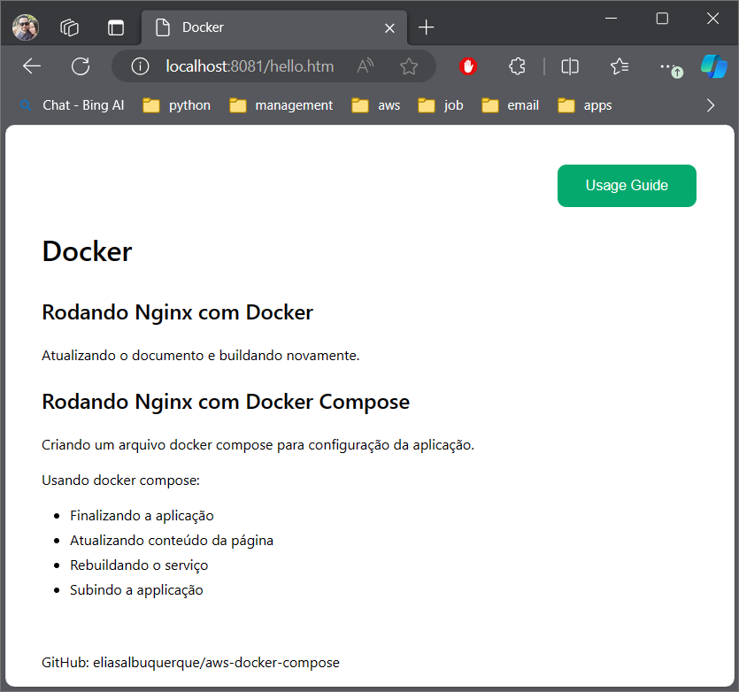

# AWS, Docker and Docker Compose

This repository contains resources and materials for the Bootcamp program. It 
focuses on the practical application of Docker and Docker Compose, with 
deployment instructions for AWS. Hands-on project to gain experience with 
containerization and cloud services.


## Table of Content <!-- omit in toc -->
- [1. Fisrt steps with Docker and docker compose](#1-fisrt-steps-with-docker-and-docker-compose)
- [2. Basics with Linux and Shell Script](#2-basics-with-linux-and-shell-script)


## 1. Fisrt steps with Docker and docker compose

This image represents a 'Hello World' application that I developed using Docker, 
Docker Compose and Nginx. The application, hosted locally, displays an HTML 
page. During the development process, the application was started and stopped 
several times for monitoring and adjustments. Additionally, the container was 
rebuilt and the application was explored in depth to fully understand its 
behavior and development flow.

Dockerfile:
```docker
FROM nginx
COPY hello /usr/share/nginx/html
```

Docker compose:
```yml
version: '3'
services:
  web-hello-world:
    build: .
    ports:
      - 8081:80
```

Web page:



The completion of this first part resulted in a web page running locally and the 
creation of the document [docker-guide.md](./docker-guide.md) with the main 
commands used in the development of the application.


## 2. Basics with Linux and Shell Script

This simple Linux project involves creating, organizing, and automating tasks 
using basic command-line actions. It starts by utilizing the `mkdir` command to 
create a new directory, followed by the `mv` command to move a file into that 
directory. Subsequently, a shell script file is created using a text editor 
`nvim`. 

The project extends to building a master shell script that executes other 
scripts, simulating the automation of multiple tasks. Lastly, a shell script 
for listing directories is implemented using the `ls` command. This project 
provides a hands-on experience in fundamental Linux commands and basic shell 
scripting, offering a practical understanding of directory manipulation and 
script execution in a Unix-based environment.

- Summary table of the commands used in the project:

  | Command | Purpose |
  | --- | --- |
  | `mkdir` | Create a new directory |
  | `mv` | Move or rename files and directories |
  | `grep` | Search for a specific pattern in files |
  | `cat` | Display the contents of a file |
  | `chmod +x` | Make a file executable |
  | `ls` | List the contents of a directory |
  | `cd` | Change the current directory |
  | `rm` | Remove files or directories |
  | `touch` | Create a new empty file |

[Link to project](./linux-basics/)

